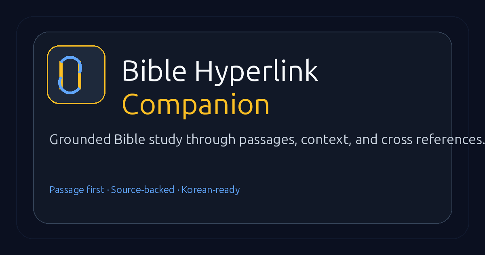

<p align="center">
  
</p>

<h1 align="center">Bible Hyperlink Companion</h1>

<p align="center">
  <strong>Passage-first Bible study for Korean and English readers.</strong><br />
  Start with one honest sentence. Follow the Bible's own links through passage, context, cross references, and related study lanes.
</p>

<p align="center">
  <a href="https://github.com/DeclanJeon/bible"></a>
  <a href="https://bible.ponslink.com"></a>
  <a href="https://nextjs.org"></a>
  
</p>

<p align="center">
  <a href="https://bible.ponslink.com/ko"><strong>한국어로 열기</strong></a>
  ·
  <a href="https://bible.ponslink.com/en"><strong>Open in English</strong></a>
  ·
  <a href="https://bible.ponslink.com/ko/bible"><strong>성경 전체 읽기</strong></a>
</p>

---

## Why this exists

Many Bible tools jump from a personal concern to a single isolated verse. Bible Hyperlink Companion keeps the study path broader and more grounded:

1. name the concern in one sentence;
2. open a primary passage;
3. read the chapter context;
4. follow cross references;
5. continue into related study lanes;
6. read the full Bible by book and chapter when needed;
7. leave anonymous feedback without creating an account.

## Product highlights

| Area | What users get |
| --- | --- |
| Prompt companion | One-sentence entry into a structured study desk. |
| Study desk | Primary passage, linked passages, author/place/audience notes, and source inventory. |
| Graph view | A compact map of why passages are connected. |
| Full Bible reader | All 66 books by book and chapter in Korean and English. |
| Anonymous reviews | Public no-login feedback board with server-side validation and file persistence. |
| Locale routing | Canonical `/ko/...` and `/en/...` paths for pages, APIs, sitemap, and metadata. |
| Safer runtime | Public diagnostics return readiness only, not provider topology or secret previews. |

## Screens and routes

| Route | Purpose |
| --- | --- |
| `/ko`, `/en` | Minimal home page and prompt entry. |
| `/ko/companion`, `/en/companion` | Deterministic study result page for a prompt. |
| `/ko/study/[slug]`, `/en/study/[slug]` | Guided study lane for a biblical theme. |
| `/ko/graph/[slug]`, `/en/graph/[slug]` | Cross-reference relationship view. |
| `/ko/bible`, `/en/bible` | Full Bible reader by book and chapter. |
| `/ko/reviews`, `/en/reviews` | Anonymous review board. |
| `/api/runtime` | Coarse readiness endpoint. |

## Architecture

```text
Next.js App Router
├─ app/[locale]              Canonical Korean / English route tree
├─ app/[locale]/api          Localized public API routes
├─ app/[locale]/reviews      Anonymous review board page
├─ components                Study desk, cards, tabs, navigation
├─ lib/bible.ts              Local Bible corpus loading and chapter index
├─ lib/retrieval.ts          Prompt-to-cluster retrieval
├─ lib/reflection.ts         Deterministic reflection response builder
├─ data/knowledge            Cross-reference knowledge data
└─ .data/reviews.json        Production review storage, ignored by Git
```

## Tech stack

- Next.js App Router
- React 19
- TypeScript
- Tailwind CSS
- PM2 + nginx deployment on `bible.ponslink.com`

## Local development

```bash
npm ci
npm run dev
```

Open one of these:

- `http://localhost:3000/ko`
- `http://localhost:3000/en`
- `http://localhost:3000/ko/bible`

## Verification

```bash
npm audit --audit-level=moderate
npm run lint
npx tsc --noEmit
npm run build
```

## Deployment notes

Current production target:

| Item | Value |
| --- | --- |
| Host | `ponslink` |
| Directory | `/home/declan/bible` |
| Process | `pm2` app named `bible` |
| Port | `127.0.0.1:3100` |
| nginx site | `/etc/nginx/sites-enabled/bible.ponslink.com` |
| Review data | `/home/declan/bible/.data/reviews.json` |

## Data sources

- World English Bible public-domain corpus for English Bible text
- Korean Bible corpus stored locally in `korean_bible/`, derived from Open Bibles `kor-korean.osis.xml`; this is not NKRV/개역개정
- OpenBible / cross-reference derived knowledge data under `data/knowledge/`

## Operating constraints

- Keep public GET page rendering deterministic.
- Keep generated reflection behind POST flow.
- Do not expose provider hostnames, model topology, config sources, or secret previews in public diagnostics.
- Prefer canonical path locale routing over query-string locale routing.
- Keep `.data/reviews.json` out of Git and out of destructive deploy syncs.

## License

Private project unless a license is added.
