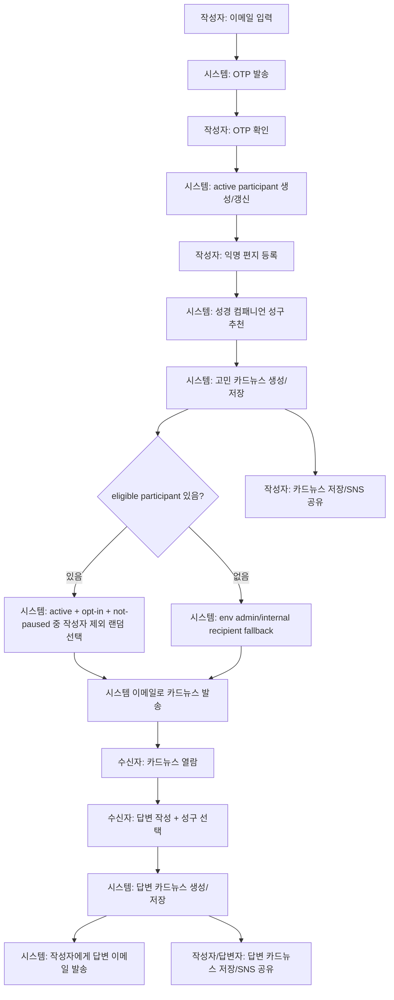

# 위로의 말씀편지 기능추가 설계문서

> bible.ponslink.com 내부 기능. 사용자가 이메일 OTP로 참여자가 된 뒤 익명으로 고민·고찰·질문을 등록하면 시스템이 카드뉴스를 생성해 저장하고, 수신에 opt-in한 active participant 중 랜덤 수신자에게 이메일로 서빙한다. eligible participant가 없을 때만 내부/admin env recipient로 fallback한다. 수신자는 시스템 화면에서 답변과 성구를 작성하고, 시스템은 그 답변을 다시 작성자에게 대신 전달한다. 작성자와 수신자의 이메일은 서로에게 절대 노출되지 않는다.

## 1. 결정 사항

- 기능명: **위로의 말씀편지**
- 기능 위치: **bible.ponslink.com 내부 기능**
- 기본 라우트: `/[locale]/letters`
- 미래 확장: 반응 검증 후 `letters.ponslink.com` 서브도메인 가능
- 핵심 형태: **익명 메시지 중계 + 카드뉴스 저장/공유 + 성경 컴패니언 성구 추천**
- MVP 방향: 별도 독립 서비스가 아니라 기존 Bible Hyperlink Companion의 확장 기능
- 참여자 모델: 이메일 OTP로 검증된 **Participant**가 익명 편지를 작성하고, `canReceiveLetters`를 켠 경우에만 다른 편지를 받을 수 있다.
- 인증 결정: **Google OAuth는 MVP 범위에서 제외**한다. 가입/수신 설정은 이메일 OTP 기반으로만 처리한다.
- 내부/admin fallback: 받을 수 있는 active participant가 없을 때만 기존 env 수신자(`LETTERS_RECIPIENT_EMAILS`/`PONSLINK_ADMIN_EMAILS`)로 fallback한다.

### 1.1 문서 상태와 구현 구분

이 문서는 두 층을 명시적으로 구분한다.

- **관찰된 현재 구현**: `/letters/join`에서 이메일 OTP로 participant를 만들고, 검증 성공 시 httpOnly participant session cookie를 발급한다. `/letters/write`는 session participant가 있으면 답장 알림 이메일 입력을 숨기고 인증 이메일을 사용하며, 미인증 사용자는 기존처럼 이메일을 직접 입력해 작성할 수 있다. `/letters/settings`는 `canReceiveLetters`, 닉네임, 선호 locale, 하루 수신 cap, 7일/30일 pause, 수신 중단을 관리한다. `/letters/history`는 session participant의 작성/수신 편지를 보여준다. `/letters/unsubscribe/[token]`은 이메일 footer의 수신 중단 링크를 처리한다. `/admin/letters`는 `ADMIN_DEBUG_TOKEN`으로 숨겨진 moderation 대시보드다. `lib/letters.ts`는 `.data/letters.json` 파일 저장소와 lock/mutate helper를 사용하며, eligible participant가 없을 때만 env recipient fallback을 쓴다. 답장·열람·session·unsubscribe token은 hash로 저장하고, `LETTERS_EMAIL_ENCRYPTION_KEY`가 설정되면 저장 파일의 author/recipient/participant raw email은 AES-GCM encrypted field로 직렬화한다.
- **의도된 participant 설계**: 이메일 OTP 검증을 거친 participant만 수신 pool에 들어간다. raw OTP/token은 저장하지 않고 hash만 저장한다. public bundle, 카드 링크, 이메일 본문, 클라이언트 번들에는 raw email, OTP, 내부 token hash, 내부 경로를 노출하지 않는다. 카드 이미지는 공개 `imageUrl`로 영속 저장하지 않고 요청 시 렌더링/다운로드하는 ephemeral asset로 취급한다.

이하에서 “현재 구현”이라고 표시하지 않은 항목은 participant MVP의 목표 설계다.

## 2. 문제 정의

교회 성도들은 고민·기도제목·신앙 질문을 가지고 있지만, 공개 카톡방·소그룹·게시판에는 말하기 어려운 경우가 많다.

기존 bible.ponslink.com은 사용자의 고민을 성경 본문과 연결해준다. 이 기능은 그 다음 단계다.

> “내 고민을 성경 말씀과 함께, 이름 모를 다른 성도에게 조용히 전달하고 답장을 받을 수 있게 한다.”

## 3. 목표

### 3.1 Product goals
- 사용자가 이메일 OTP를 통해 active participant가 될 수 있다.
- active participant는 익명으로 고민·고찰·질문을 등록할 수 있다.
- participant는 `canReceiveLetters`를 켜거나 끄고, pause/unsubscribe 상태를 직접 관리할 수 있다.
- 시스템이 고민을 카드뉴스로 생성하고 저장한다.
- 시스템이 active + opted-in + not-paused participant 중 작성자 본인을 제외하고 랜덤 수신자를 선택한다.
- eligible participant가 없을 때만 env recipient fallback으로 admin/internal 전달을 유지한다.
- 수신자는 시스템 화면에서 답변과 성구를 작성한다.
- 시스템이 답변 카드뉴스를 생성해 작성자에게 대신 전달한다.
- 카드뉴스는 저장하거나 SNS로 공유할 수 있다.
- 작성자와 수신자의 이메일은 서로에게 노출되지 않는다.

### 3.2 Non-goals
- 공개 익명 게시판이 아니다.
- 실시간 채팅이 아니다.
- 상담 서비스가 아니다.
- 유저끼리 직접 이메일을 주고받는 기능이 아니다.
- AI가 답변 본문을 대신 쓰는 기능이 아니다.
- 독립 도메인/독립 브랜드 런칭이 아니다.
- Google OAuth 또는 소셜 로그인 도입이 아니다.
- 프로필, 친구, 팔로우, 교회별 그룹 매칭이 아니다.

## 4. 핵심 원칙

### P1. 시스템이 중계자다
- 모든 발송은 시스템 이메일에서 나간다.
- 작성자 이메일은 수신자에게 보이지 않는다.
- 수신자 이메일은 작성자에게 보이지 않는다.
- 답변은 이메일 reply가 아니라 시스템 링크에서 작성한다.

### P2. 카드뉴스가 1차 산출물이다
- 고민은 카드뉴스로 저장된다.
- 답변도 카드뉴스로 저장된다.
- 카드뉴스는 이메일·웹·SNS 공유에서 동일한 콘텐츠 단위로 사용된다.

### P3. 성경 컴패니언은 성구 추천만 담당한다
- 성경 컴패니언은 고민/답변 맥락에 맞는 성구를 추천한다.
- 답변 본문은 사람이 작성한다.
- 최종 성구 선택도 사람이 한다.

### P4. 익명성은 UX의 핵심 신뢰다
- 이메일, userId, IP, 내부 토큰은 상대에게 노출하지 않는다.
- 닉네임은 선택 사항이다.
- 닉네임에 이메일/연락처 형식이 들어가면 막거나 경고한다.

## 5. 사용자 플로우



## 6. Route 설계

| Route | 목적 | 공개 여부 |
| --- | --- | --- |
| `/[locale]/letters` | 기능 소개/랜딩 + 참여자 join CTA | 공개 |
| `/[locale]/letters/join` | 이메일 OTP 요청 | 공개 |
| `/[locale]/letters/verify` | OTP 입력/검증, participant 활성화 | OTP 접근 |
| `/[locale]/letters/settings` | 수신 opt-in, pause, 빈도, unsubscribe 관리 | 이메일 magic/OTP 접근 |
| `/[locale]/letters/unsubscribe/[token]` | 원클릭 수신 거부/재개 안내 | 토큰 접근 |
| `/[locale]/letters/history` | 내가 작성한 편지와 내가 받은 편지 확인 | participant session |
| `/[locale]/letters/write` | 익명 편지 작성 | active participant 또는 OTP 검증 후 작성 |
| `/[locale]/letters/card/[cardId]` | 고민 카드뉴스 보기/저장/공유 | visibility 기준 |
| `/[locale]/letters/reply/[token]` | 수신자 답변 작성 | 토큰 접근 |
| `/[locale]/letters/answer/[token]` | 작성자 답변 카드뉴스 열람 | 토큰 접근 |
| `/[locale]/letters/sent` | 발송 완료 화면 | 작성 직후 |
| `/[locale]/admin/letters?token=...` | 편지 moderation/운영 대시보드 | `ADMIN_DEBUG_TOKEN` |

Locale은 기존 제품처럼 `/ko`, `/en` 라우팅을 따른다.

## 7. API 설계

| Method | Endpoint | 역할 |
| --- | --- | --- |
| `POST` | `/[locale]/api/letters/participants/request-otp` | 이메일 OTP 요청, cooldown 적용 |
| `POST` | `/[locale]/api/letters/participants/verify-otp` | OTP 검증, active participant 생성/갱신 |
| `GET` | `/[locale]/api/letters/participants/settings` | participant 설정 조회, token/OTP 접근 |
| `POST` | `/[locale]/api/letters/participants/settings` | `canReceiveLetters`, pause, locale, frequency 저장 |
| `POST` | `/[locale]/api/letters/participants/unsubscribe` | 수신 거부 처리 |
| `GET` | `/[locale]/api/letters/participants/history` | participant session 기반 작성/수신 편지 내역 조회 |
| `POST` | `/[locale]/api/letters` | 익명 편지 생성, 성구 추천, 카드뉴스 생성, participant 랜덤 매칭/발송 트리거 |
| `GET` | `/[locale]/api/letters/card/[cardId]` | 카드뉴스 데이터 조회 |
| `POST` | `/[locale]/api/letters/card/[cardId]/share` | 공유 visibility 변경 또는 공유 링크 생성 |
| `POST` | `/[locale]/api/letters/reply/[token]` | 답변 제출, 답변 카드뉴스 생성, 작성자에게 이메일 발송 |
| `POST` | `/[locale]/api/letters/reply/[token]/suggest` | 답변 작성 중 성구 추천 |
| `POST` | `/[locale]/api/letters/report` | 부적절한 편지/답변 신고 |

## 8. 화면 설계

### 8.1 `/[locale]/letters` — 랜딩
목적:
- 위로의 말씀편지가 무엇인지 설명한다.
- 이메일이 상대에게 노출되지 않는다는 점을 강조한다.
- 카드뉴스 예시를 보여준다.
- 작성 CTA로 연결한다.

핵심 카피:
- “익명의 고민을 말씀 카드로 만들어 누군가에게 조용히 전해보세요.”
- “답변은 시스템을 통해 전달되며, 이메일은 서로에게 보이지 않습니다.”

CTA:
- Primary: `익명 말씀편지 쓰기`
- Secondary: `이메일로 참여하기`
- Tertiary: `수신 설정 관리`

### 8.2 `/[locale]/letters/write` — 작성
필드:
- 닉네임: 선택
- 카테고리: `고민`, `고찰`, `질문`, `기도제목`
- 본문: 20~1200자
- 답변 받을 이메일: active participant session이 있으면 표시하지 않는다. 미검증 사용자는 작성 전/제출 전 OTP 검증으로 participant를 만든다.
- 수신 참여 opt-in: “나도 다른 말씀편지를 받아보고 답장할 수 있어요.” 체크박스. 기본값은 안전하게 off이며, 켜면 `canReceiveLetters=true`로 저장한다.
- MVP 공유 허용: 기본 `링크 공유`; `비공개`/`공개 피드`는 토큰 접근·목록 정책이 추가될 때까지 노출하지 않는다.

제출 후:
- 성경 컴패니언으로 추천 성구 생성
- 고민 카드뉴스 생성
- 랜덤 수신자 선택
- 이메일 발송
- `/[locale]/letters/card/[cardId]` 또는 sent 화면으로 이동

### 8.3 `/[locale]/letters/card/[cardId]` — 카드뉴스 보기/저장/공유
기능:
- 고민 카드뉴스 미리보기
- `이미지로 저장`
- `공유 링크 복사`
- `SNS로 공유`
- 발송 상태 표시: `전달 중`, `전달 완료`, `답변 도착`

공유 정책:
- MVP: `unlisted` 카드만 생성한다. 카드는 공개 목록에 올라가지 않고, 난수 카드 링크를 가진 사람만 열 수 있다.
- `private`: 작성자/토큰 접근 증명이 구현될 때까지 bare card URL에서 반환하지 않는다.
- `public`: 공개 피드/검색/목록 정책이 구현될 때까지 UI에 노출하지 않는다.

### 8.4 수신 이메일
구성:
1. 브랜드: `Bible Hyperlink Companion`
2. 제목: “익명의 말씀편지가 도착했습니다”
3. 닉네임 또는 “익명의 작성자”
4. 고민 카드뉴스 이미지
5. 추천 성구 1개
6. CTA: `답변과 성구 보내기`

금지:
- 작성자 이메일 표시 금지
- 작성자 userId 표시 금지
- 원문 토큰 노출 금지

### 8.5 `/[locale]/letters/reply/[token]` — 답변 작성
표시:
- 받은 고민 카드뉴스
- 추천 성구
- 답변 작성 폼

필드:
- 답변자 닉네임: 선택
- 답변 본문
- 추천 성구 선택
- 직접 성구 입력/선택

CTA:
- `답변 카드 보내기`

카피:
- “당신의 이메일은 작성자에게 보이지 않습니다.”
- “정답을 말하기보다, 읽고 마음에 남은 위로를 적어주세요.”

### 8.6 `/[locale]/letters/answer/[token]` — 답변 열람
기능:
- 답변 카드뉴스 보기
- 선택 성구 강조
- `이미지로 저장`
- `SNS로 공유`
- `말씀 전체 읽기`

### 8.7 `/[locale]/letters/join` + `/verify` — 참여 시작
목적:
- Google OAuth 없이 이메일 소유만 확인한다.
- “회원가입”보다 가볍게 “이메일로 참여하기”로 표현한다.

화면 흐름:
1. 이메일 입력.
2. “6자리 확인 코드를 보냈어요” 상태.
3. OTP 입력.
4. 성공 시 작성 화면 또는 설정 화면으로 이동.

UX 요구:
- OTP 재발송은 cooldown 상태와 남은 시간을 알려준다.
- OTP 오류는 “코드가 맞지 않거나 만료되었습니다”처럼 원인을 과도하게 노출하지 않는다.
- public bundle에는 이메일을 표시하지 않고 `a***@domain` 같은 마스킹도 기본 노출하지 않는다.

### 8.8 `/[locale]/letters/settings` — 참여/수신 설정
필드:
- `canReceiveLetters`: 다른 편지를 받을지 여부.
- `pausedUntil`: 잠시 쉬기. 예: 7일, 30일, 직접 재개.
- preferred locale: `ko`/`en`.
- frequency cap 안내: “하루 최대 1통”.
- `unsubscribe`: 즉시 수신 제외.
- current usage: 오늘 수신 횟수/하루 cap, 다음 eligible 시점 안내.

카피:
- “받는 것을 멈춰도 내가 쓴 편지와 받은 답장은 사라지지 않습니다.”
- “언제든 다시 참여할 수 있습니다.”

### 8.9 `/[locale]/letters/unsubscribe/[token]` — 수신 거부
목적:
- 이메일 하단의 한 번 클릭으로 수신 제외를 보장한다.
- 실수 클릭을 고려해 확인 화면에서 “다시 받기”를 제공한다.

금지:
- unsubscribe 화면에서 raw email, raw token, participant id를 보여주지 않는다.

### 8.10 `/[locale]/letters/history` — 내 편지함
목적:
- participant session으로 내가 작성한 편지와 내가 받은 편지를 확인한다.
- 작성/수신 내역은 public bundle과 동일하게 email/token/hash/generation internals를 제거한다.
- 답변이 있는 경우 작성자 또는 수신 participant에게 필요한 답변 본문과 선택 성구만 보여준다.

### 8.11 `/[locale]/admin/letters` — moderation
목적:
- `ADMIN_DEBUG_TOKEN` query token으로만 열리는 운영 화면이다.
- 통계, 최근 편지 excerpt, 신고, participant masked 상태, delivery 상태를 보여준다.
- raw email, raw token, token hash, generation metadata는 표시하지 않는다.


## 9. UI/UX 디자인

### 9.1 디자인 원칙
- **단일 코드베이스 반응형 설계**: 모바일/태블릿/데스크탑은 동일 페이지에서 해상도별 레이아웃만 전환한다.
- **본문 우선 계층**: 고민 본문, 성구, 답변은 언제든 먼저 읽을 수 있어야 한다.
- **익명 신뢰**: 이메일·userId·토큰 노출 금지는 UI 문구에도 반영한다.
- **가벼운 진입**: 편지 작성·열람·답변 모두 스크롤 1회 이내에 주요 액션이 보여야 한다.
- **보조 콘텐츠 분리**: 카드뉴스 저장/공유/신고는 주 흐름을 방해하지 않는 보조 영역에 둔다.
- **한국어 가독성**: 한국어 본문은 영어 카드보다 줄간격과 여백을 넉넉히 잡는다.
- **완료 상태 명확성**: `전달 중`, `전달 완료`, `답변 도착` 상태는 배지/상태 텍스트로 즉시 인식 가능해야 한다.

### 9.2 해상도 기준
MVP는 아래 3개 해상도 브레이크포인트를 기준으로 설계한다.

| 구분 | 기준 | 핵심 컬럼 구조 |
| --- | --- | --- |
| Mobile | `width < 640px` | 단일 컬럼, 상하 스택 |
| Tablet | `640px ≤ width < 1024px` | 2컬럼 또는 카드형 배치 |
| Desktop | `width ≥ 1024px` | 2~3컬럼, 사이드 패널/요약 영역 활용 |

추가 기준:
- 태블릿은 양손 잡이 사용을 고려해 주요 CTA를 하단 고정 영역에 배치한다.
- 데스크탑은 카드뉴스 미리보기와 작성 폼을 같은 화면에서 확인할 수 있도록 한다.
- 이미지 카드뉴스는 기본 `1:1` 비율을 유지하되, 목록에서는 축소 썸네일로 보여준다.

### 9.3 공통 레이아웃 컴포넌트

#### A. PageHeader
- 브랜드 표기: `Bible Hyperlink Companion`
- 페이지 보조 타이틀: `위로의 말씀편지`
- 모바일에서는 2줄까지 허용, 데스크탑에서는 1줄 유지

#### B. TrustNotice
- “이메일은 서로에게 보이지 않습니다.” 문구는 작성 화면·답변 화면·카드뉴스 상세에 모두 노출한다.
- 모바일: 입력 영역 상단 고정 배너
- 태블릿/데스크탑: 사이드 또는 상단 안내 박스

#### C. LetterCardPreview
- `1:1` 카드뉴스 미리보기
- 모바일: 폭 100%, 하단 액션 버튼 노출
- 태블릿: 폭 최대 `480px`, 우측 또는 하단 액션 영역
- 데스크탑: 폭 최대 `560px`, 액션 패널은 같은 행 또는 사이드 패널

#### D. ScriptureBlock
- 성구 reference는 상단, 본문은 큰 타이포, 설명은 보조 텍스트
- 모바일에서는 성구 본문이 카드의 주 시각 요소가 되도록 배경을 단순화한다.

#### E. ActionBar
- `이미지로 저장`, `공유 링크 복사`, `SNS로 공유`, `신고`
- 모바일: 하단 sticky bar 또는 하단 고정 버튼 영역
- 태블릿/데스크탑: 카드 우측 또는 하단 인라인 버튼 그룹

#### F. StepIndicator
- 작성 흐름은 `1. 내용 입력 → 2. 성구 확인/선택 → 3. 전송 완료`로 표시한다.
- 답변 흐름은 `1. 고민 확인 → 2. 성구 추천/선택 → 3. 답변 작성 → 4. 전송 완료`로 표시한다.
- 모바일은 compact step indicator, 데스크탑은 상단 full step bar

### 9.4 페이지별 반응형 설계

#### 9.4.1 `/[locale]/letters` 랜딩
모바일:
- 상단 히어로 문장 1~2줄
- CTA 버튼 상단 고정 또는 스크린 절반 이내 노출
- 카드뉴스 예시는 1열 카드 캐러셀 또는 단일 미리보기

태블릿:
- 히어로 + 카드뉴스 예시 2단 배치

데스크탑:
- 히어로/설명 좌측, 카드뉴스 예시 우측
- 하단 FAQ/신뢰 안내 영역 분리

#### 9.4.2 `/[locale]/letters/write` 작성
모바일:
- 단일 컬럼 폼
- 닉네임 / 카테고리 / 본문 / 이메일 / 공유 허용 순서
- 하단 고정 CTA: `익명 말씀편지 보내기`

태블릿:
- 본문 입력 영역을 확장하고, 공유 설정/보조 설명을 같은 행에 배치 가능

데스크탑:
- 좌측 메인 폼, 우측 보조 패널: 신뢰 안내, 성구 추천 미리보기, 카드뉴스 미리보기

핵심 상호작용:
- 본문 1200자 도달 시 하드 리밋 안내
- 위기 감지 결과는 인라인 안내 + CTA 비활성화
- 성구 추천 결과는 `추천 성구` 카드 블록으로 표시

#### 9.4.3 `/[locale]/letters/card/[cardId]`
모바일:
- 카드뉴스 이미지 상단
- 상태 배지 다음 노출
- 액션 버튼 하단 sticky

태블릿:
- 카드뉴스 이미지 중앙, 좌/우 또는 하단에 액션 그룹

데스크탑:
- 좌측 카드뉴스 미리보기, 우측 상태/공유/상세 정보 패널

상태 표현:
- `전달 중`: neutral 배지
- `전달 완료`: success 배지
- `답변 도착`: emphasis 배지 + CTA 강조

#### 9.4.4 `/[locale]/letters/reply/[token]`
모바일:
- 받은 고민 카드뉴스 축소 미리보기 후 답변 작성 폼 노출
- 성구 추천은 collapse 가능한 목록
- 하단 고정 CTA: `답변 카드 보내기`

태블릿:
- 고민 카드뉴스와 답변 입력을 상하 또는 2단으로 배치

데스크탑:
- 좌측 고민 카드뉴스/성구, 우측 답변 작성 폼

핵심 UX:
- 답변 작성 부담을 줄이기 위해 `추천 성구 먼저 선택` 흐름을 지원한다.
- 성구 선택 후 답변 카드뉴스 미리보기를 바로 노출할 수 있다.

#### 9.4.5 `/[locale]/letters/answer/[token]`
모바일:
- 답변 카드뉴스 이미지 상단
- 선택 성구 강조 블록
- 하단 액션: 저장/공유

태블릿/데스크탑:
- 카드뉴스와 상세 정보를 같은 화면에서 확인 가능하도록 배치
- `말씀 전체 읽기` 버튼은 성구 영역 바로 아래에 둔다.

#### 9.4.6 이메일 카드뉴스
이메일은 반응형 웹 레이아웃과 별도로 모바일 이메일 클라이언트 호환성을 우선한다.
- 단일 컬럼, 폭 `600px` 이내
- 이미지 alt text 포함
- CTA 버튼은 터치 영역 `44px` 이상
- 이메일 내부에는 답변 입력 폼을 넣지 않고, 시스템 웹 링크로만 연결한다.

### 9.5 입력/상호작용 설계

#### 편지 작성
- 본문 placeholder: “지금 마음에 있는 고민이나 생각을 적어주세요.”
- 카테고리 기본값: `고민`
- 성구 추천 노출 조건: 본문 20자 이상
- 추천 성구는 `기본 1개`, `더보기` 선택 시 최대 3~5개
- 미검증 이메일이면 제출 CTA 직전에 OTP 확인 단계를 끼워 넣는다.
- opt-in 체크박스는 “다른 사람의 말씀편지도 받아보고 답장할래요”처럼 능동적 참여로 설명한다.

#### OTP 확인
- 입력은 6자리 숫자 one-time code에 최적화한다.
- 모바일에서는 `inputmode="numeric"`과 자동완성 `one-time-code`를 사용한다.
- resend는 cooldown 중 disabled + 남은 시간 표시.
- 오류 메시지는 `role="alert"`로 노출한다.

#### 답변 작성
- 성구 추천은 먼저 보여주고, 답변 본문은 그다음에 적게 유도한다.
- 답변자에게는 짧은 문장을 유도하는 안내 문구를 노출한다.
- 추천 성구 선택은 라디오 카드 또는 pill 카드 형태

#### 카드뉴스 저장/공유
- `이미지로 저장`: 서버 공개 URL이 아니라 현재 카드 데이터를 기반으로 생성한 PNG 다운로드 기본
- `공유 링크 복사`: 토스트 피드백
- `SNS로 공유`: Web Share API 지원 시 기본 시트, 미지원 시 개별 버튼 노출

### 9.6 접근성/가독성 기준
- WCAG 2.1 AA 대비 기준 충족
- 텍스트는 배경 이미지 위에 올라갈 때 반드시 오버레이 또는 안전 영역 처리
- 성구 reference는 스크린리더에서 `scripture reference`로 읽히도록 semantics 부여
- 버튼은 아이콘만 사용하지 않고 텍스트 라벨을 반드시 포함
- 상태 배지는 색에만 의존하지 않고 텍스트 라벨을 함께 사용
- Tab 순서는 본문 흐름 순서를 따른다
- 카드뉴스 alt text는 `kind`, `scriptureRef`, `요약 1문장`을 포함한다.

### 9.6.1 OTP/프라이버시/접근성 요구사항
- OTP는 6자리 코드로 설명하되 raw OTP 저장을 금지하고 hash + 만료시간 + 시도횟수만 저장한다.
- OTP 요청/검증에는 이메일별·IP별 cooldown과 일일 cap을 둔다.
- OTP 화면은 숫자 입력, 붙여넣기, 자동완성, 키보드만으로 제출이 가능해야 한다.
- raw email은 서버 내부 발송에만 사용하고 public bundle, 클라이언트 상태, 카드 데이터, 생성 프롬프트, 이미지 metadata에 포함하지 않는다.
- raw reply/read/unsubscribe token은 저장하지 않고 hash만 저장한다.
- 이메일 하단에는 수신 설정/수신 거부 링크를 항상 둔다.
- 수신 opt-in은 명시적이어야 하며 pre-checked로 만들지 않는다.
- “익명” 카피는 상대에게 이메일이 보이지 않는다는 뜻이지 운영 저장소에 아무 데이터도 없다는 뜻으로 오해시키지 않는다.
- 모든 join/settings/unsubscribe CTA는 44px 이상 터치 영역, visible focus, 색상 외 텍스트 라벨을 갖는다.

### 9.7 톤/비주얼 가이드
- 메인 톤: 따뜻하고 절제된 신앙적 위로
- 주요 색상 방향: 아이보리/크림 배경, 짙은 갈색 본문, 보조 강조는 차분한 금/청록/네이비
- 그림자/유리효과: 과도한 블러/네온 금지
- 카드뉴스 미리보기: 편지지 느낌은 가능하지만, 본문 가독성을 해치지 않게 절제
- 장식선/구분선은 성구 영역과 본문 경계에만 제한적으로 사용

### 9.8 반응형 QA 체크리스트
- 모바일에서 작성 CTA가 첫 화면에 보이는가
- 모바일에서 카드뉴스 이미지가 화면 폭을 넘치지 않는가
- 태블릿에서 성구 추천과 답변 입력을 동시에 확인할 수 있는가
- 데스크탑에서 카드뉴스와 상태/공유 패널을 같은 화면에서 볼 수 있는가
- 공유 버튼 영역이 터치 가능 최소 크기(`44px`) 이상인가
- 상태 변화(`전달 중/완료/답변 도착`)가 즉시 인식 가능한가
- 이메일 카드뉴스가 모바일 메일 클라이언트에서 깨지지 않는가
- 성구/답변 텍스트가 해상도에 따라 잘리는지 확인했는가
- 어두운 배경 이미지 위에서도 본문 대비가 유지되는가
- 신고 버튼이 주요 흐름을 방해하지 않으면서도 발견 가능한 위치인가


### 10.1 고민 카드뉴스
포함:
- `Bible Hyperlink Companion`
- `익명의 말씀편지`
- 닉네임 또는 `익명의 작성자`
- 카테고리
- 고민 본문 또는 요약
- 추천 성구
- `bible.ponslink.com` 출처 표기

예시:

```text
┌──────────────────────────────┐
│ Bible Hyperlink Companion     │
│ 익명의 말씀편지               │
├──────────────────────────────┤
│ from. 익명의 작성자           │
│                              │
│ “요즘 내가 왜 살아야 하는지   │
│ 잘 모르겠습니다…”             │
├──────────────────────────────┤
│ 함께 읽어볼 말씀              │
│ 시편 23:1-3                  │
│ 여호와는 나의 목자시니…       │
└──────────────────────────────┘
```

### 10.2 답변 카드뉴스
포함:
- `익명의 답장`
- 답변자 닉네임 또는 `익명의 답장`
- 답변 본문
- 선택 성구
- `bible.ponslink.com` 출처 표기

예시:

```text
┌──────────────────────────────┐
│ 익명의 답장                  │
├──────────────────────────────┤
│ “당신의 질문을 가볍게        │
│ 지나치고 싶지 않았습니다…”   │
├──────────────────────────────┤
│ 제가 함께 두고 싶은 말씀      │
│ 로마서 8:38-39               │
└──────────────────────────────┘
```

### 10.3 카드뉴스 이미지 생성기
카드뉴스 PNG는 로컬 HTML 렌더링이 아니라 `ssh ponslink` 내부의 Codex Imagen Node CLI로 생성한다.

확인된 원격 경로:
- CLI: `/home/declan/bin/codex-imagen`
- 앱 소스: `/home/declan/apps/codex-imagen`
- Node entry: `/home/declan/apps/codex-imagen/bin/codex-imagen.js`
- 관련 adapter: `/opt/cardnews-ai/releases/20260627145111/pipeline-service/dist/imagen-adapter.d.ts`

CLI 지원 옵션:

```bash
codex-imagen "prompt" --output <path> --json
codex-imagen --prompt-file <path> --output <path> --json
```

설계상 bible 앱은 직접 이미지를 그리지 않고 `CardImageGenerator` adapter를 둔다.

```ts
type CardImageGeneratorInput = {
  cardId: string;
  kind: "question" | "answer";
  locale: "ko" | "en";
  title: string;
  body: string;
  scriptureRef: string;
  scriptureExcerpt: string;
  visualTheme: {
    coreMessage: string;
    spiritualTheme: string;
    emotionalTone: string;
    visualMetaphor: string;
    environment: string;
    includeHumanFigure: boolean;
  };
};

type CardImageGeneratorOutput = {
  ephemeralImagePath?: string;
  metadata: Record<string, unknown>;
};
```

운영 방식:
1. bible 앱이 카드뉴스용 prompt 파일을 생성한다.
2. 원격 실행 adapter가 `ssh ponslink /home/declan/bin/codex-imagen --prompt-file <prompt> --output <output.png> --json`을 호출한다.
3. 생성된 PNG는 공개 object storage/CDN URL로 영속 저장하지 않는다.
4. 공유 화면과 다운로드는 저장된 카드 데이터로 HTML preview 또는 단기 생성 파일을 렌더링한다.
5. 이메일은 공개 이미지 URL에 의존하지 않고 카드 링크/텍스트/성구 CTA를 우선한다.

요구사항:
- 생성 실패 시 편지/답변 자체는 저장하고 `generationStatus: "failed"`로 둔다.
- 발송 이메일에는 공개 이미지 URL이 아니라 카드 링크와 텍스트/성구 요약을 우선 사용한다.
- 생성 시간이 길 수 있으므로 API 요청 안에서 장시간 blocking하지 말고 job/queue 또는 background task로 분리한다.
- 프롬프트에는 이메일, userId, IP, 내부 토큰을 절대 넣지 않는다.
- 민감 본문은 전체 원문 대신 요약본으로 이미지화할 수 있다.

프롬프트 스타일:
- 한국어 카드뉴스.
- 따뜻하지만 과장 없는 신앙적 위로.
- 성구는 선명하고 읽기 쉽게.
- 개인정보/연락처/실명 노출 금지.
- `bible.ponslink.com` 출처 표기.


프롬프트 생성 원칙:
- 범용 “성경구절 카드뉴스” 프롬프트를 그대로 쓰지 않는다.
- 먼저 성구를 해석하고, 그 의미에 맞는 이미지 은유를 고른 뒤, 마지막에 카드뉴스를 렌더링한다.
- 핵심 지시문은 반드시 포함한다: `Do not choose a generic background first. First interpret the verse, identify its spiritual theme and emotional tone, then choose a scene and visual metaphor that best expresses that meaning.`
- 성구는 단순 텍스트가 아니라 카드 분위기를 결정하는 엔진으로 취급한다.

내부 해석 슬롯:

```text
Interpret the verse and infer the following internally:
- Core message
- Emotional tone
- Spiritual theme
- Best visual metaphor
- Best environment
- Whether a human figure should appear or not
- Whether the image should feel intimate, majestic, quiet, or triumphant
```

테마별 이미지 매핑:

| 성구 테마 | 추천 이미지 방향 |
| --- | --- |
| 위로 / 쉼 / 신뢰 | 들판, 고요한 새벽, 벤치, 쉼터, 따뜻한 빛, 치유적 풍경 |
| 용기 / 담대함 / 소명 / 약속 | 산길, 광야, 능선, 먼 지평선, 전진하는 인물 |
| 인도 / 목자 / 보호 / 공급 | 길, 강가, 푸른 초장, 목자적 분위기, 안전한 풍경 |
| 기도 / 평안 | 조용한 방, 무릎 꿇음, 하늘빛, 고요한 창문 |
| 빛 / 진리 / 생명 / 계시 | 어둠 속 한 줄기 빛, 새벽, 등불, 광휘, 열리는 하늘 |
| 창조 / 태초 / 말씀 / 영원 / 위엄 | 광대한 하늘, 우주적 빛, 시작의 여명, 넓은 대지, 장엄한 신성감 |
| 사랑 / 교제 / 거함 | 따뜻한 테이블, 정원, 포도나무, 가까운 존재감, 함께 머무는 빛 |
| 회개 / 죄 / 용서 / 은혜 | 돌아오는 길, 비 개인 하늘, 집으로 향하는 빛, 씻김과 회복 |
| 부활 / 승리 | 찬란한 새벽, 열린 공간, 밝아지는 하늘, 돌파하는 빛 |

권장 생성 구조는 2단계다.

1단계 — 성구 해석:

```text
Read the following Bible verse and analyze it for image generation.

Return:
1. core_message
2. spiritual_theme
3. emotional_tone
4. recommended_visual_metaphor
5. recommended_environment
6. should_include_human_figure
7. suggested_card_title

Verse:
"{VERSE_TEXT}"
Reference:
"{VERSE_REFERENCE}"
```

2단계 — Codex Imagen 최종 프롬프트:

```text
Create one finished square Instagram Bible verse card in Korean.

Important:
Do not generate a generic Christian image.
Do not choose a generic background first.
First interpret the verse and understand its spiritual meaning, emotional tone, and symbolic message.
Then create a scene that visually matches that meaning.

Use the following interpretation:

Core message: {CORE_MESSAGE}
Spiritual theme: {SPIRITUAL_THEME}
Emotional tone: {EMOTIONAL_TONE}
Visual metaphor: {VISUAL_METAPHOR}
Environment: {ENVIRONMENT}
Human figure: {HUMAN_FIGURE}
Card title: {CARD_TITLE}

Visual style:
Premium Korean devotional card, painterly storybook illustration, cinematic lighting, elegant and reverent mood, soft atmospheric light, slightly textured brushwork, polished and beautiful.
Not photorealistic. Not cartoon. Not flat vector.

Composition:
- 1:1 square Instagram format
- large readable Korean verse text
- small thematic title at the top
- scripture reference below
- clean balanced layout
- background and imagery must support the verse meaning
- keep enough negative space for Korean typography

Text:
Title: "{CARD_TITLE}"
Verse:
"{VERSE_TEXT}"
Reference:
"{VERSE_REFERENCE}"

Typography:
- elegant Korean serif or calligraphic typography
- high contrast against the background
- readable dark brown, sepia, ivory, or another appropriate contrast color
- subtle ornamental divider lines only if suitable

Restrictions:
- no watermark
- no logo
- no email
- no personal names unless explicitly approved
- no phone number
- no user id
- no token
- no visual element that turns the verse into a generic landscape unrelated to its meaning

Generate one final square devotional Bible verse card image.
```

구현 규칙:
- `buildPassageRecommendation()`에서 받은 성구와 설명을 기반으로 `visualTheme`을 먼저 만든다.
- `visualTheme`이 비어 있으면 위 매핑표로 fallback한다.
- `question` 카드에는 고민 본문을 전면에 길게 노출하지 말고 성구/요약 중심으로 이미지화한다.
- `answer` 카드에는 답변자의 위로 문장과 선택 성구를 함께 넣되, 본문이 길면 1~2문장으로 요약한다.
- 같은 “새벽빛/길/한 사람” 구도가 반복되지 않도록 `spiritualTheme`별 시각 은유를 다르게 고른다.

로컬 개발 fallback:
- 원격 CLI가 없을 때는 placeholder 카드 또는 HTML preview만 표시한다.
- production 완료 조건은 Codex Imagen PNG 생성 성공이다.


### 10.4 저장/공유
MVP 저장 방식:
- HTML 카드 미리보기
- PNG 다운로드 또는 이미지 저장 기능
- 공유 URL 복사

SNS 공유:
- Web Share API
- 카카오톡 공유
- X/Twitter 공유
- Facebook 공유

공유용 카드에는 민감한 본문 전체 대신 요약본을 사용할 수 있다.

## 11. 수신자 선택 규칙

### 11.1 관찰된 현재 구현
- `pickRecipient()`는 active + opted-in + not-paused + not-unsubscribed participant 중 작성자 이메일 hash와 다른 참여자를 후보로 만든다.
- 후보 중 편지 locale과 participant `preferredLocale`이 같은 사람이 있으면 그 그룹에서 우선 랜덤 선택한다.
- participant별 하루 수신 cap은 `maxLettersPerDay`로 관리하며 기본 3, 설정 UI에서 1/2/3으로 낮출 수 있다. 12시간 cooldown과 24시간 window cap을 동시에 적용한다.
- eligible participant가 없을 때만 env recipient 목록(`LETTERS_RECIPIENT_EMAILS` 또는 `PONSLINK_ADMIN_EMAILS`)에서 작성자 이메일 hash와 다른 주소를 fallback으로 고른다.

### 11.2 Participant MVP 목표 규칙
- 대상: `status="active"`, `emailVerifiedAt` 있음, `canReceiveLetters=true`, `unsubscribedAt` 없음, `pausedUntil`이 현재보다 과거 또는 없음.
- 작성자 본인은 `participantId`와 `emailHash` 기준으로 제외한다.
- locale이 같으면 우선 매칭한다.
- 하루 수신 상한: participant가 설정한 `maxLettersPerDay`를 적용한다. MVP UI는 1/2/3 중 선택한다.
- 기본 발송 대상: 랜덤 1명.
- 최근 받은 편지가 미답변이어도 수신은 가능하되, 일일 cap과 pause가 우선한다.
- eligible participant가 없으면 env recipient fallback으로 admin/internal 수신자에게 보낸다.
- fallback으로 보낸 경우 작성자에게 “운영팀 검토/내부 전달”처럼 수신자 존재를 과장하지 않는다.

수신자가 누구인지는 작성자에게 보여주지 않는다. 작성자가 누구인지는 수신자에게 보여주지 않는다.

## 12. 성경 컴패니언 연동

기존 함수 사용:

```ts
buildPassageRecommendation(prompt, { locale })
```

### 12.1 고민 카드 생성 시
입력:
- 작성자의 고민 본문

출력 사용:
- primary reference
- 짧은 성구 excerpt
- 추천 이유 한 문장
- 말씀 전체 읽기 링크

### 12.2 답변 작성 시
입력:
- 원 고민 본문
- 답변 초안 또는 답변자가 입력한 키워드

출력 사용:
- 성구 후보 목록
- 답변자가 최종 선택

## 13. 데이터 모델

### 13.1 관찰된 현재 구현
실제 구현은 `lib/letters.ts`의 JSON 파일 저장소를 사용한다. `AnonymousLetter`, `LetterCard`, `LetterDelivery`, `LetterAnswer`, `LetterReport`, `LetterParticipant` 배열을 lock/mutate helper로 갱신한다. `LETTERS_EMAIL_ENCRYPTION_KEY`가 없으면 기존 raw email 호환 저장을 유지하고, 설정되어 있으면 write 직렬화 단계에서 author/recipient/participant email을 `emailEncrypted` 계열 필드로 저장한다. read 단계는 raw 또는 encrypted field를 복원해 서버 내부 발송에만 사용한다.

### 13.2 Participant MVP 목표 모델

```ts
type LetterVisibility = "private" | "unlisted" | "public";
type ParticipantStatus = "pending" | "active" | "paused" | "unsubscribed";

type LetterParticipant = {
  id: string;
  emailHash: string;
  emailEncrypted: string;
  status: ParticipantStatus;
  locale: "ko" | "en";
  canReceiveLetters: boolean;
  emailVerifiedAt?: string;
  pausedUntil?: string;
  unsubscribedAt?: string;
  lastOtpRequestedAt?: string;
  lastReceivedAt?: string;
  dailyReceivedCount?: number;
  dailyReceivedDate?: string;
  createdAt: string;
  updatedAt: string;
};

type LetterOtpChallenge = {
  id: string;
  emailHash: string;
  otpHash: string;
  purpose: "join" | "settings";
  attempts: number;
  expiresAt: string;
  consumedAt?: string;
  createdAt: string;
};

type AnonymousLetter = {
  id: string;
  authorParticipantId: string;
  authorEmailHash: string;
  authorNickname?: string;
  locale: "ko" | "en";
  category: "concern" | "reflection" | "question" | "prayer";
  body: string;
  status: "created" | "matched" | "sent" | "answered" | "blocked";
  shareVisibility: LetterVisibility;
  createdAt: string;
};

type LetterCard = {
  id: string;
  letterId: string;
  answerId?: string;
  kind: "question" | "answer";
  title: string;
  summary: string;
  imageUrl?: never;
  shareUrl?: string;
  generationProvider: "codex-imagen";
  generationStatus: "pending" | "generating" | "ready" | "failed" | "skipped";
  generationMetadata?: Record<string, unknown>;
  visibility: LetterVisibility;
  createdAt: string;
};

type LetterDelivery = {
  id: string;
  letterId: string;
  recipientParticipantId?: string;
  fallbackRecipientEmailHash?: string;
  status: "sent" | "opened" | "answered" | "expired" | "skipped";
  replyTokenHash: string;
  sentAt?: string;
  expiresAt: string;
};

type LetterAnswer = {
  id: string;
  letterId: string;
  deliveryId: string;
  responderParticipantId?: string;
  responderNickname?: string;
  body: string;
  scriptureRef: string;
  answerCardId: string;
  readTokenHash: string;
  createdAt: string;
};
```

보안상 OTP, reply/read/unsubscribe token 원문은 저장하지 않고 hash만 저장한다. raw email은 발송 가능한 서버 저장소에서만 암호화 보관하고 public DTO에는 `emailHash`조차 기본 노출하지 않는다.

## 14. 이메일 발송 설계

발신자:

```text
Bible Hyperlink Companion <no-reply@bible.ponslink.com>
```

이메일 종류:
1. OTP 확인 이메일
2. 랜덤 participant 또는 fallback 수신자에게 보내는 고민 카드뉴스 이메일
3. 작성자에게 보내는 답변 도착 이메일
4. 수신 설정/수신 거부 확인 이메일
5. 신고/차단 등 운영 알림은 MVP 후순위

이메일 본문에 포함:
- 카드 링크 또는 텍스트 카드 요약
- 답변 작성 링크
- 말씀 전체 읽기 링크
- 수신 거부/설정 링크
- OTP 이메일에서는 6자리 코드와 만료 시간

이메일 본문에 미포함:
- 작성자 이메일
- 수신자 이메일
- userId / participantId
- IP
- 내부 토큰 원문
- raw OTP hash 또는 검증 metadata

## 15. 안전장치

MVP 최소 안전장치:
- 본문 길이 제한: 20~1200자
- 닉네임에 이메일/전화번호/카카오톡 ID 입력 금지 또는 경고
- 작성자 본인 매칭 금지
- 수신 거부 participant 제외
- IP 기준 기본 레이트리밋
- 신고 버튼
- 위기 표현 감지

위기 감지는 기존 `assessPromptSafety()` 사용:

- `none`: 정상 발송
- `caution`: 발송 가능, 조심스러운 안내 포함
- `crisis`: 랜덤 발송하지 않고 도움 안내 표시


### 15.1 Participant/OTP 최소 안전장치
- OTP 요청은 이메일/IP 기준 cooldown과 일일 cap을 둔다.
- OTP 검증은 만료시간, 최대 시도 횟수, 소비 처리(consumedAt)를 갖는다.
- 수신 후보는 active opt-in participant만 포함하고 paused/unsubscribed participant는 제외한다.
- 작성자 본인은 participantId와 emailHash 양쪽으로 제외한다.
- 일일 수신 cap을 초과한 participant는 제외한다.
- env recipient fallback은 eligible participant가 0명일 때만 사용한다.
- unsubscribe는 이메일마다 항상 접근 가능해야 하며, 처리 후 즉시 matching pool에서 빠진다.

## 16. MVP 범위

### MVP 1 — Participant join + 익명 편지 카드뉴스 발송
반드시 포함:
- `/letters` 랜딩
- `/letters/join` 이메일 OTP 요청
- `/letters/verify` OTP 검증
- `/letters/settings` 수신 opt-in/pause/unsubscribe 설정
- `/letters/write` 작성 화면
- 익명 편지 생성 API
- 성경 컴패니언 성구 1개 추천
- Codex Imagen 기반 고민 카드뉴스 생성/저장 또는 HTML preview fallback
- active opt-in participant 중 랜덤 1명 선택
- eligible participant가 없을 때 env recipient fallback
- 시스템 이메일 발송
- 카드뉴스 보기/저장/공유 링크

### MVP 2 — 답변 중계
반드시 포함:
- 답변 작성 링크
- `/letters/reply/[token]`
- 답변자 닉네임 선택
- 답변 본문 작성
- 성구 추천/선택
- Codex Imagen 기반 답변 카드뉴스 생성/저장 또는 HTML preview fallback
- 작성자에게 시스템 이메일 발송
- 답변 카드뉴스 저장/SNS 공유

### MVP 제외
- 공개 피드
- 댓글
- 실시간 채팅
- 팔로우
- 다중 답장 랭킹
- 카드뉴스 편집기
- 교회별 관리자 대시보드
- 독립 도메인

## 17. 구현 순서

1. Participant JSON 모델과 OTP challenge 저장 모델 추가
2. OTP 요청/검증 API 추가
3. `/[locale]/letters/join` 및 `/verify` 화면 추가
4. `/[locale]/letters/settings` 및 unsubscribe 처리 추가
5. `/[locale]/letters/write`를 active participant/OTP 흐름에 연결
6. `POST /[locale]/api/letters`가 participant author를 사용하도록 전환
7. 성경 컴패니언 추천 연결 유지
8. Codex Imagen 카드뉴스 생성 adapter를 ephemeral 이미지 정책에 맞게 정리
9. active opt-in participant pool에서 랜덤 수신자 선택
10. eligible participant가 없을 때 env fallback 유지
11. 시스템 이메일 발송 연결
12. `/[locale]/letters/reply/[token]` 답변 화면 구현
13. 답변 카드뉴스 생성/저장
14. 작성자에게 답변 이메일 발송
15. 저장/SNS 공유 UX 마감
16. `/[locale]/letters/history` participant 편지함 추가
17. `/[locale]/admin/letters` moderation 대시보드 추가
18. optional email-at-rest encryption 지원

## 18. 성공 기준

MVP 검증 지표:
- 익명 편지 작성 전환율
- 이메일 오픈율
- 답변 작성률
- 카드뉴스 저장률
- 카드뉴스 공유율
- 신고/스팸 비율
- 반복 작성/반복 답변 비율

핵심 성공 기준:

> 받은 사람이 실제로 답변과 성구를 작성하는가?

답변 작성이 발생하면 이 기능은 단순 콘텐츠가 아니라 교회적 돌봄 루프가 된다.

## 19. 최종 요약

이 기능은 별도 도메인의 독립 서비스가 아니라 **bible.ponslink.com 내부의 관계형 말씀 기능**이다.

핵심은 다음 한 문장이다.

> 작성자와 수신자는 서로의 이메일을 모른다. 시스템이 익명 편지와 답변을 카드뉴스로 만들어 양쪽에 대신 서빙한다.

우선순위:
1. Google OAuth 없이 이메일 OTP participant를 만든다.
2. active opt-in participant만 수신 pool에 넣고 paused/unsubscribed 사용자는 제외한다.
3. 받을 사람이 없을 때만 env recipient fallback을 유지한다.
4. 카드뉴스 저장/공유를 핵심 경험으로 만들되 공개 이미지 URL은 영속 저장하지 않는다.
5. 성경 컴패니언은 성구 추천으로 자연스럽게 붙인다.
6. 시스템 중계로 이메일 비노출을 보장한다.
7. 답변 기능은 MVP 2단계로 붙여도 되지만 최종 구조에는 포함한다.
